# Start here: intern guide

## The project in one minute

The public web is not equally accessible to every visitor. A page may load for a person but reject a crawler, require JavaScript, expose an API, prohibit automated use in its terms, or be absent from public archives.

This project measures those conditions on a reproducible sample of domains. It stores the evidence behind each finding, repeats the same measurements over time, and compares patterns across sectors, regions, and popularity bands.

The collector characterizes public interfaces. It does not log in, solve CAPTCHAs, bypass paywalls, evade blocks, or collect a site's content corpus.

## What exists now

- A policy-aware scanner records 110 technical and policy signals in ten families.
- Every HTTP attempt is bounded and auditable; `robots.txt`, pacing, request limits, and cease-list entries affect execution.
- Results are immutable, schema-versioned JSON snapshots.
- A SQLite batch runner can stop, resume, and preserve progress.
- A deterministic sampler creates an auditable domain-selection manifest.
- An exporter produces `runs.csv`, `observations.csv`, `changes.csv`, and `summary.json`.
- Offline tests cover parsers, safety rules, collection, batching, schema compatibility, sampling, and analysis.

This is a strong collection prototype, not a finished index. Some findings are direct facts; others are conservative hints or candidate links. The next scientific task is to establish where each detector is accurate enough to support analysis.

## How one scan works

```mermaid
flowchart LR
    target["Reviewed domain"] --> safety["Normalize and check destination"]
    safety --> policy["DNS, TLS, and robots policy"]
    policy --> probes["Bounded HTTP probes"]
    probes --> optional["Optional browser or archive checks"]
    optional --> snapshot["Immutable evidence snapshot"]
    snapshot --> export["Validated analysis tables"]
    export --> figures["Diagnostics and research figures"]
```



The probes are small modules under `src/web_openness/probes/`. They share a client that enforces destination safety, request budgets, pacing, redirects, retries, and response-size limits. A probe emits observations; it does not assign index weights.

## How to read an observation

Each signal has a value, method, confidence, evidence, and one outcome:

| Outcome | Meaning |
| --- | --- |
| `observed` | The probe obtained an interpretable result. The value may validly be `false`. |
| `no_evidence` | The probe ran but did not find the specified evidence. |
| `skipped` | Policy, budget, applicability, or pacing prevented collection. |
| `error` | Collection or parsing failed. |

Never convert the last three outcomes to `false`. That would make missing data look like an open or closed website.

## Your first hour

```bash
git clone https://github.com/shayne-longpre/web-openness-index.git
cd web-openness-index
uv sync --all-groups
make check
uv run web-openness --help
```

Then read, in order:

1. [Measurement coverage](measurement_coverage.md): what the 110 signals mean and where they are weak.
2. [Architecture](architecture.md): how the modules and data flow fit together.
3. [Pilot sampling](methodology/pilot_sampling.md): what population the study can describe.
4. [Contributing](../CONTRIBUTING.md): how to make a small, testable change.

Do not begin with a large live scan. Unit tests are offline; live collection requires a reviewed target list, cease list, published scanner identity, and the [deployment gate](deployment.md).

## Work plan

1. **Validate detectors.** Build labeled positive, negative, and ambiguous fixtures for one signal family. Report precision, recall, and abstention rather than tuning on the research sample.
2. **Freeze the pilot frame.** Document frame sources, licenses, deduplication, sector/geography labels, popularity bands, inclusion probabilities, and the selection seed.
3. **Run a 24–36 domain canary.** Check safety controls, requests per domain, 403/429 rates, schema validity, runtime, missingness, and obvious detector errors.
4. **Run the 432-domain pilot.** Preserve the exact code revision, configuration, target manifest, logs, snapshots, and collection disposition for every domain.
5. **Audit data quality.** Measure detector accuracy, missingness by stratum, repeatability, operational cost, and sensitivity to collector changes.
6. **Produce descriptive figures.** Begin with coverage and failure plots, then substantive comparisons. Follow the [plot roadmap](plots.md).
7. **Decide whether scoring is justified.** Only validated signals with sufficient coverage enter the preregistered [scoring method](methodology/scoring.md).
8. **Scale only when needed.** Add workers or storage services when pilot measurements show a bottleneck; keep the same scanner and snapshot contracts.

## A good first contribution

Choose one narrow detector family, such as `robots.txt` AI-agent rules, paywall markup, CDN hints, or policy-language extraction. Collect public examples for understanding, then encode only short synthetic or permission-safe fixtures in tests. Label clear positives, clear negatives, and ambiguous cases before changing the detector. Submit one pull request containing the fixtures, expected outcomes, detector change if needed, and a short accuracy/limitations note.

This task teaches the evidence model and improves research validity without requiring a live crawl.

## Collaboration standard

- Make one conceptual change per pull request.
- Explain the research claim before editing its detector.
- Keep tests offline and deterministic.
- Preserve uncertain cases as uncertain.
- Do not store response bodies, cookies, credentials, or personal data unless a reviewed protocol requires them.
- Ask before changing the signal registry, schema, sampling rules, or collection policy; those changes affect comparability.

When in doubt, prefer a smaller claim with visible evidence.
