# Architecture

## Purpose

The system turns a reviewed domain list into immutable evidence and analysis tables. It is deliberately small: one Python package, local files, and SQLite are enough for detector work and the first pilot.

The central boundary is:

> Collection records evidence. Analysis interprets evidence. Scoring comes only after validation.

This prevents a changed detector or index weight from rewriting what the scanner actually observed.

## Data flow

```mermaid
flowchart LR
    frame["Frozen sampling frame"] --> targets["Reviewed target list"]
    targets --> runner["Restart-safe batch runner"]
    runner --> scanner["Policy-aware scanner"]
    scanner --> probes["Independent probes"]
    probes --> snapshots["Immutable JSON snapshots"]
    snapshots --> validate["Schema validation"]
    validate --> tables["Runs, observations, and changes tables"]
    tables --> quality["Quality checks"]
    quality --> plots["Figures and later scores"]
```

For one domain, the scanner:

1. normalizes the target and rejects unsafe destinations;
2. collects bounded public DNS and TLS evidence;
3. fetches and applies `robots.txt`;
4. runs allowed sitemap, homepage, response, metadata, barrier, policy, and well-known probes within one shared HTTP budget;
5. optionally runs one non-interactive browser render and bounded preservation checks;
6. summarizes every attempt and writes a new schema-versioned snapshot.

A probe failure is recorded and isolated; it does not erase other observations.

## Module map

| Module | Owns | Must not own |
| --- | --- | --- |
| `config.py` | Explicit collection limits and identity | Hidden environment-dependent policy |
| `url_safety.py` | Public-destination validation | Measurement interpretation |
| `client.py` | HTTP budgets, redirects, retries, size limits, attempt evidence | Probe-specific parsing |
| `politeness.py` | Cross-run pacing, `Retry-After`, temporary circuit state | Research outcomes |
| `probes/` | One bounded measurement family per module | Index weights or unmanaged clients |
| `pipeline.py` | Deterministic probe order and error isolation | Batch scheduling |
| `models.py` | Versioned observation and snapshot contracts | Detector rules |
| `signals.py` | Operational smoke-test key registry | Planned or aspirational measures |
| `storage.py` | Atomic immutable snapshot writes | Mutable analytical state |
| `runner.py` | Jobs, leases, stop/resume, progress | Raw evidence storage |
| `frame.py` | Canonicalization and deterministic stratified selection | Ad hoc convenience sampling |
| `analysis.py` | Snapshot validation and flat-table exports | Unregistered scoring decisions |
| `cli.py` | Thin command wiring | Core collection logic |

Large modules are acceptable when they contain one cohesive responsibility. Split a module when two parts need different tests, dependencies, or change cycles—not to satisfy a line-count target.

## Probe contract

Every probe receives a shared `ProbeContext` and returns observations. A probe should:

- have a stable name;
- use prior probe results when needed rather than repeat requests;
- use the shared policy-enforcing client for network work;
- stay within declared request, byte, redirect, and time bounds;
- distinguish a negative value from no evidence, a skip, and an error;
- attach a method, confidence, and minimal evidence;
- be deterministic for fixed response fixtures.

The default order is intentional: network and DNS metadata, robots policy, sitemap, homepage, response evidence, metadata, page signals, policy declarations, optional browser evidence, well-known files, preservation, and final attempt summaries. Low-value optional work runs after core evidence so it cannot consume the budget first.

## Evidence contract

A `DomainSnapshot` is the durable research record. It includes:

- run and collector identifiers;
- canonical domain and origin;
- start and completion times;
- observations keyed by stable signal name;
- attempt-level request records;
- probe errors and request counts;
- schema version.

Snapshots are written atomically and never updated in place. Derived CSV, Parquet, figures, and scores can be regenerated from them. Stored evidence should be sufficient to audit a claim but should exclude response bodies, cookies, credentials, personal data, and unnecessary query strings.

## Current runtime

| Need | Current component | Reason |
| --- | --- | --- |
| Single scan | CLI plus `Scanner` | Fast detector development |
| Small canary | `smoke` command | Coverage and gap diagnosis |
| Restart-safe batch | SQLite runner | Leases, stop/resume, and durable disposition without a service |
| Cross-worker pacing | SQLite politeness state | One rule for sibling hosts and later runs |
| Evidence | JSON files | Inspectable, immutable, schema-valid records |
| Analysis | CSV/JSON exports | Works with Python, R, or DuckDB |
| CI | Offline fixtures | Fast, repeatable, and safe |

SQLite assumes one shared filesystem and one coordinator per run. That is a deliberate pilot constraint, not a production-distributed database design.

## Quality checks

Every pull request should run:

1. formatting and linting;
2. strict type checking;
3. offline unit and pipeline tests;
4. JSON Schema compatibility checks;
5. tests for every changed detector's positive, negative, skipped, and malformed cases.

Live canaries are separate research operations. They test real-web drift, request bounds, safety controls, runtime, and evidence writes; unstable live responses must not become CI expectations.

Before an analytic release, also require a reproducible selection manifest, schema-valid snapshots, collection disposition for every sampled unit, missingness by stratum, detector accuracy, repeatability checks, and recorded code/configuration revisions.

## Scaling rule

Do not build a distributed platform before the pilot measures a constraint.

1. **Now:** run one coordinator with low concurrency and one identifiable static egress address.
2. **If runtime requires it:** split a frozen target manifest into deterministic shards and run a few independent workers. Give each worker its own state database and identifiable address; combine immutable snapshots after completion.
3. **Only if coordination becomes the bottleneck:** replace the SQLite job adapter with a managed queue/catalog and move snapshots to object storage. Keep the scanner, probes, models, and analysis contracts unchanged.
4. **Only after stable releases exist:** add a read API or dashboard over curated tables, never over worker state.

Scale decisions should use measured domains/hour, requests and bytes/domain, browser cost, failure rates, storage growth, operator effort, and complaint load. The [deployment guide](deployment.md) defines the network and identity controls that remain required at every scale.

## Intentional non-goals

- full-site or recursive crawling;
- authenticated actions or form submission;
- CAPTCHA, paywall, geographic, or bot-control evasion;
- vulnerability scanning;
- storing a content corpus;
- assigning scores inside probes;
- inferring exact vendor products or enabled features without direct evidence;
- adding Kubernetes, a queue cluster, or a dashboard for its own sake.

These constraints keep the system auditable, low-burden, and aligned with the research question.
