# Architecture and infrastructure plan

## Goal

Build a reproducible longitudinal measurement system that can start as a local batch collector, then scale to a scheduled multi-worker observatory without rewriting its core measurement logic.

The central architectural decision is to separate **collection**, **evidence**, **classification**, **scoring**, and **publication**. Raw observations should survive changes to detectors and scoring methodology.

## Design constraints

1. **Policy is part of the runtime.** Request budgets, delays, user-agent identity, `robots.txt` decisions, redirects, and retry behavior must be explicit and logged.
2. **Raw evidence is immutable.** A collection run writes a new versioned snapshot; it never updates a previous result in place.
3. **Probes are plugins.** Each probe declares what it measures and is independently testable with recorded or synthetic responses.
4. **Scores are downstream products.** Collection code never embeds mutable index weights.
5. **Browser work is isolated.** Playwright workers scale and fail independently from lightweight HTTP workers.
6. **Local and production execution share code.** The local CLI and distributed workers invoke the same pipeline and schemas.
7. **Unknown is first-class.** Failures and missing evidence are not silently converted to negative findings.

## Logical architecture

```mermaid
flowchart LR
    registry["Domain registry and sampling frame"] --> scheduler["Scheduler"]
    scheduler --> queue["Scan jobs"]
    queue --> http["HTTP probe workers"]
    queue --> browser["Isolated browser workers"]
    http --> evidence["Immutable evidence store"]
    browser --> evidence
    evidence --> validate["Schema and quality validation"]
    validate --> catalog["Snapshot catalog"]
    catalog --> transform["Versioned classifications and scores"]
    transform --> analytics["Longitudinal analytical tables"]
    analytics --> api["Read API"]
    analytics --> exports["Public data releases"]
    api --> dashboard["Dashboard"]
```

## Module boundaries

### Collector core

The collector core owns target normalization, request policy, probe execution, evidence capture, confidence representation, and snapshot serialization. It must not depend on a scheduler, queue, database, or dashboard.

The initial Python package follows these boundaries:

- `models.py`: stable, versioned interchange models;
- `config.py`: explicit runtime policy;
- `client.py`: request budget, delay, response bounds, and request audit trail;
- `probes/`: one module per measurement family;
- `pipeline.py`: deterministic orchestration and error isolation;
- `storage.py`: snapshot persistence behind a small interface;
- `cli.py`: a thin local entry point.

### Probe contract

Every probe should:

- have a stable name and version;
- accept a shared scan context rather than global state;
- use the policy-enforcing network clients;
- return observations and evidence without calculating index weights;
- distinguish negative findings, absent evidence, skipped work, and failures;
- be deterministic for a fixed response fixture.

Future probes fall into four worker classes:

| Worker class | Examples | Isolation need |
| --- | --- | --- |
| DNS/TLS | Resolver, certificate, protocol support | Lightweight async process |
| HTTP | Robots, homepage, well-known files, API discovery | Lightweight async process |
| Browser | JavaScript requirement, cookie wall, CAPTCHA, rendered screenshot | Sandboxed browser process |
| Document analysis | Terms, licenses, API documentation | CPU/model worker with strict provenance |

### Evidence store and catalog

Use two stores with distinct responsibilities:

- **Object storage** holds immutable JSON snapshots, redacted response excerpts, and screenshots. Keys are content-addressed or run-addressed and lifecycle-managed.
- **PostgreSQL** holds the domain registry, sampling strata, job state, snapshot pointers, schema versions, and operational metadata.

Do not place large HTML bodies or screenshots in PostgreSQL. Do not use the job queue as a source of truth.

For local development, the filesystem implements object storage and SQLite holds restart-safe job
and politeness state. These are deliberately small adapters for one coordinator, not substitutes
for the production catalog and queue. DuckDB can query local JSON/Parquet exports without requiring
a service.

### Transform and scoring layer

Transforms read validated snapshots and produce versioned analytical tables. A score record should identify:

- input snapshot IDs;
- schema version;
- detector versions;
- scoring-methodology version;
- sampling-frame version;
- code revision;
- generated timestamp.

This layer can begin with Python and DuckDB. If scale warrants it, the same tables can move to a managed analytical warehouse without changing collector contracts.

### API and dashboard

The public API is read-only and serves curated analytical tables, methodology metadata, and per-domain evidence summaries. The dashboard should consume the same API or published columnar files used by external researchers; it should not query worker state or raw queue data.

Static pre-rendering is preferred for public aggregate pages. Interactive per-domain and longitudinal views can use a small read API with aggressive caching.

## Environments

### Local

- `uv` for deterministic Python environments;
- JSON snapshots on disk;
- SQLite run, lease, stop-control, and registrable-domain pacing state;
- mocked responses for tests;
- optional live canary scans behind an explicit marker;
- DuckDB for exploratory analysis when the first dataset exists.

Target: a new contributor can install, run the offline tests, and produce a single-domain snapshot in under ten minutes.

### Preview

- one container image for lightweight workers;
- a separate browser-worker image with Playwright dependencies;
- a small PostgreSQL instance;
- an object-storage bucket with short retention for preview evidence;
- a managed queue;
- ephemeral dashboard/API deployments per pull request when those components exist.

Target: exercise the real job lifecycle against a small allow-listed domain set without publishing results.

### Production

- infrastructure as code under `infra/`, organized into reusable `network`, `data`, `queue`, `workers`, `scheduler`, `observability`, and `publication` modules;
- scheduled cohort creation rather than one job per domain created ad hoc;
- autoscaled HTTP and browser worker pools with separate concurrency limits;
- immutable object storage with retention and release policies;
- PostgreSQL backups and migrations;
- a warehouse or object-backed analytical layer;
- a cached read API and static/public data exports;
- centralized logs, metrics, traces, and budget alerts.

The first production deployment should choose the cloud provider only after a representative batch establishes bandwidth, browser, storage, and scheduling requirements. The module boundaries above are intentionally provider-neutral.

## Job lifecycle

1. A versioned sampling frame selects a domain and assigns a scan policy.
2. The scheduler emits an idempotent job keyed by domain, cohort, and scheduled time.
3. A worker acquires the job and writes an initial run record.
4. Policy-aware probes collect bounded evidence.
5. Large artifacts are written to object storage and referenced by digest.
6. The completed snapshot is validated against the declared schema.
7. The catalog records the immutable snapshot pointer and quality state.
8. Downstream transforms classify observations and calculate versioned scores.
9. Release jobs publish aggregate tables and dashboard-ready assets.

Retries create new attempts under the same logical job. A retry never overwrites the evidence from an earlier attempt.

## Fast testing strategy

### Pull-request checks

Every pull request should complete these offline checks:

1. formatting and linting;
2. static type checking;
3. unit tests for parsers, policies, and scoring functions;
4. pipeline tests with deterministic mock transports;
5. schema compatibility tests using committed fixture snapshots;
6. packaging and CLI smoke tests.

These checks should remain network-free and finish in a few minutes.

### Scheduled checks

A small, explicitly maintained canary set can run daily or weekly to detect real-web drift. Canary results are diagnostic and should not enter the research dataset automatically. Tests should assert invariants—bounded requests, valid schema, successful evidence writes—rather than expecting unstable websites to return fixed content.

### Detector validation

Each heuristic detector needs a labeled fixture set with precision/recall reporting and examples of abstention. Browser-based detections such as paywalls, CAPTCHAs, and JavaScript requirements should not graduate into scoring until their validation set and known failure modes are published.

### Research release gate

Before publishing an index release:

- freeze the sampling frame and methodology version;
- validate missingness and error rates by stratum;
- inspect temporal discontinuities after collector upgrades;
- rerun a reproducible subset from retained evidence;
- document detector accuracy and known blind spots;
- generate checksums and a machine-readable release manifest.

## Observability

Operational dashboards should track:

- job throughput, age, retries, and terminal failure rate;
- requests and bytes per domain;
- response status and timeout distributions;
- robots-denied and policy-skipped rates;
- browser crash and memory rates;
- snapshot validation failures;
- missingness by metric, sector, and geography;
- storage growth and estimated cost per completed domain;
- detector-version changes and resulting distribution shifts.

Logs must avoid response bodies, credentials, cookies, and unnecessary query strings. Artifact access should be least-privilege and audited.

## Security and research safeguards

- Validate targets and block private, link-local, metadata-service, and otherwise sensitive network ranges in hosted workers.
- Re-resolve and revalidate destinations across redirects to mitigate SSRF and DNS rebinding.
- Disable credential persistence and authenticated browser profiles.
- Strip cookies and sensitive headers from stored evidence.
- Apply response-size, redirect, wall-clock, and request-count limits.
- Keep browser workers ephemeral, sandboxed, and isolated from control-plane credentials.
- Maintain a public collector identity, contact channel, and opt-out process.
- Pause cohorts automatically when error, block, or complaint thresholds are exceeded.

## Delivery plan

### Phase 0: runnable foundation — current

- Versioned observation schema
- Committed JSON Schema and deterministic compatibility fixture
- Budgeted and delayed HTTP client
- Persistent pacing, bounded transient retry, circuit breaking, and robots crawl-delay handling
- Restart-safe SQLite batch jobs with leases, deferrals, progress, and stop controls
- DNS/TLS, robots, sitemap, homepage, metadata, and `llms.txt` probes
- Public scanner identity, cease-list enforcement, and deployment safeguards
- Immutable local JSON output
- Offline test suite and CI
- Public README and architecture plan

Exit criterion: a clean checkout can pass all checks and produce a policy-compliant snapshot for one domain.

### Phase 1: research MVP

- Versioned domain registry and sampling strata
- Headers, CDN/WAF, DNS-provider, hosting-provider, and HTTP-protocol probes
- Playwright worker for browser-versus-HTTP and screenshot evidence
- Fixture-based validation for login, paywall, cookie-wall, CAPTCHA, and JavaScript signals
- Parquet export and DuckDB analysis notebooks/scripts
- Documented scoring proposal, sensitivity analysis, and release manifest

Exit criterion: a reproducible pilot across a stratified domain sample with audited request volume, missingness, and detector performance.

### Phase 2: scheduled observatory

- Queue-backed workers and scheduler
- Object storage and PostgreSQL catalog
- Idempotent job control, migrations, retention, and backups
- Production observability and pause controls
- Read API and initial longitudinal dashboard

Exit criterion: repeatable weekly collection with operational and research quality gates.

### Phase 3: extended access dimensions

- Agent-interface discovery and capability ladder
- Legal and economic access datasets
- Preservation measurements
- Calibrated aggregate indices and downloadable public releases

Exit criterion: versioned, citeable releases that explain who can access a domain, under what conditions, through which interfaces, and how that changes over time.

## Near-term decisions to record as ADRs

The implementation should add short architecture decision records before committing to:

- the initial domain sampling frame;
- the exact transparent user-agent and contact policy;
- evidence retention and response-excerpt rules;
- browser execution and screenshot policy;
- cloud provider and managed queue;
- analytical table format and warehouse;
- scoring aggregation and missing-data treatment;
- public release licensing.
